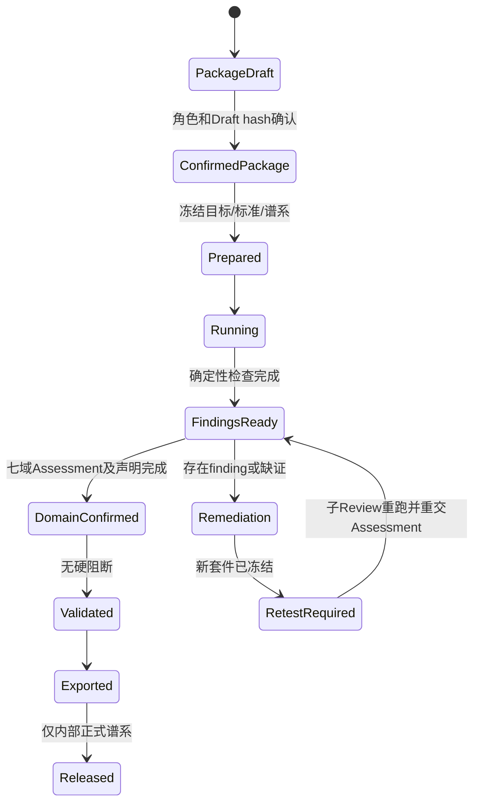

# 研报套件七域审查系统架构

> 实现与复核日期：2026-08-29。服务：`lvke-deliverable-review`。本文描述当前代码边界，不代表法律意见、专业签章、身份认证或电子签名。

## 1. 架构与责任边界

```mermaid
flowchart LR
  A[Lvke不可变对象或外部文件] --> B[SourceFile解析/OCR/安全扫描]
  B --> C[ReviewPackageDraft 自动角色建议]
  C --> D[人工确认角色和关键OCR片段]
  D --> E[不可变 ReviewPackage]
  R[冻结标准包/适用范围] --> F[MCP确定性审查]
  E --> F
  E --> G[七个隔离Agent上下文]
  R --> G
  F --> H[append-only Review事件链]
  G -->|ReviewAssessment.v1| H
  H --> I[ReviewDimensionResult.v1]
  I --> J[领域责任声明确认]
  J --> K[服务端硬门禁汇总]
  K --> L[propose/diff/apply 整改]
  L --> M[不可变子Review复测]
  M --> N[JSON/MD/DOCX/PDF/XLSX/批注定位版]
  N --> O{Release资格}
  O -->|仅内部同一FormalPromotion| P[正式Release]
  O -->|外部套件| Q[仅审查Dossier]
```



MCP 只执行服务端编码的确定性检查、对象/哈希/locator/工作区校验、事件投影和 verdict 计算，不暗中调用模型。七个 Agent 上下文分别承担合规、文章、数据、来源、财务模型、财务表、可行性语义审查。汇总上下文只能读取领域结果，不能改写原 Assessment。领域确认是责任声明，不证明身份或执业资格。

## 2. 对象与状态机



新增不可变对象存储：`ReviewPackageDraft.v1`、`ReviewPackage.v1`、`ReviewExtractionConfirmation.v1`、`ReviewAssessment.v1`、`ReviewDimensionConfirmation.v1`、`ReviewDimensionResult.v1`、`ReviewDossier.v2`。Finalize 为七个领域分别持久化内容寻址的 DimensionResult，Dossier 绑定其精确 ID；所有对象暴露工作区限定 Resource。历史 Review v1 保持原语义，不自动升级为七域完整审查。

## 3. 套件与模式

完整套件必须同时包含：报告正文、来源证据、基础数据、财务模型、财务表。角色由服务端建议、调用方逐件确认；缺少任一类时 `full_suite=false`，只能形成专项结论。

| 模式 | 输入 | 谱系与发布 |
|---|---|---|
| `internal` | Lvke 不可变对象或正式 SourceFile | 每个组件重新解析父对象并验证同一 FormalPromotion；混合、篡改、跨工作区、历史无签名全部失败关闭 |
| `external` | 导入的 DOCX/PDF/XLS/XLSX/XLSM/CSV/附件 | 可生成完整审查 Dossier；永远带 `external_review_release_forbidden`，不能获得 Lvke Release 资格 |

| Profile | 能力边界 |
|---|---|
| `quick` | 确定性硬门禁预览；永远不是正式七域完整审查 |
| `standard` | 七域确定性检查 + 七个独立语义 Assessment + 七域确认 |
| `deep` | standard + 强制 `ARTICLE.VISUAL.LAYOUT` 覆盖、深度工作簿扫描/隔离重算；未处理页面失败关闭 |

## 4. 七域能力矩阵

| 领域 | MCP 确定性实现 | Agent/专业判断 |
|---|---|---|
| 合规 | 冻结版本化标准包；校验包/hash/发布方/官方 URL；地区和项目类型范围；缺失状态投影 | 法规适用、条款实质符合性和专业认定。结论只允许“对已检查要求符合/发现不符合/证据不足/待专业认定” |
| 文章质量 | 占位符、长段重复、结构文本可用性 | 错病句、术语、事实冲突、论证跳跃、图表引用、逐页视觉和相似性解释 |
| 数据质量 | CSV 表头、空值、重复行、期间/数值解析、结构化 locator | 单位/实体/口径、异常合理性、转换和跨材料传播 |
| 来源信息 | SourceFile 身份/hash/locator/fragment、解析状态、工作区绑定 | 权威性、时效、冲突、循环引用和 claim 语义支持 |
| 财务模型 | 公式错误、外链、隐藏表、命名区域、易变函数、宏容器、循环/迭代、复制公式、隔离重算、数值快照 | 假设合理性、税债折旧营运资金、敏感性和业务逻辑 |
| 财务表 | 模型/表同名期间数值快照比对、工作簿完整性 | 表内/跨表/三表/月年/正文同源和口径实质审查 |
| 可行性 | 市场、方案、投资融资、财务、风险结论结构覆盖 | 市场到规模、方案到投资、运营到财务、风险到结论的完整论证链和决策充分性 |

XLSM 宏只被识别并记录限制，绝不执行。扫描件中要求确认的关键数字、法规引用或低置信度片段，必须经 `review_confirm_extraction` 的 source hash + locator + fragment hash 校验；确认提取结果不代表确认其语义。

## 5. 接口流程

```text
review_package_prepare -> review_package_confirm -> review_confirm_extraction
-> review_resolve_standards -> review_prepare -> review_start
-> 7 x review_submit_assessment -> 7 x review_confirm_dimension
-> review_finalize -> review_disposition_finding
-> propose/diff/apply -> review_retest -> child assessments/finalize
-> review_export -> internal Release gate
```

Assessment 必须使用已登记 semantic `check_id`，显式列出 `coverage.checked_check_ids`，记录唯一 `reviewer_context_id`、Skill/模型/版本/执行环境，并为每条 finding 提供冻结套件内的可验证片段或明确缺证原因。不同领域复用同一 context ID 会被服务端拒绝。

## 6. 门禁、整改与导出

- 任一 P0、未豁免 P1、缺五类材料、必审维度 `incomplete/not_determinable`、未确认领域、未确认 OCR、标准或谱系不完整均不得 pass。
- P0 永不豁免。P1 必须同时记录范围、影响、补偿措施、责任人、未来到期日、失效条件和精确证据。
- 套件复测为两阶段：创建子 Review 后返回 `retest_assessment_required`；受影响语义检查未重交且七域未重新确认/finalize 前，父 finding 不会关闭。
- JSON 为完整审计状态；XLSX 包含 findings、七域矩阵、标准快照和审计 manifest；DOCX/PDF 是审查报告；annotated DOCX 是 locator 问题定位版，不伪装成 Word 原生评论或修改原文件。
- PDF 依赖隔离 LibreOffice worker；不可用时明确失败，不生成伪 PDF。

## 7. 已验证与限制

截至 2026-08-29，目标/回归测试覆盖：五文件外审成功链、五类材料缺失、独立上下文、伪造 locator、内审无签名来源、未确认/不可判定领域、P0/P1 豁免边界、套件复测 pending、七个独立 DimensionResult Resource、旧 Review/Release 回归。全量测试为 530 passed、1163 subtests passed；14 个 live stdio 服务为 180 tools、242 resources，五文件外审协议链总体 pass 且外审 Release 资格为 false。

当前明确限制：系统不做法律批准、执业签章、身份/资质认证、电子签名；外部 XLS 受可用转换器约束；XLSM 不执行；语义审查质量取决于独立 Agent/专业人员；checked-in 标准包的范围不等于涵盖所有国家、湖北、行业和项目特例，无法建立适用性或效力时必须输出证据不足/待专业认定。
